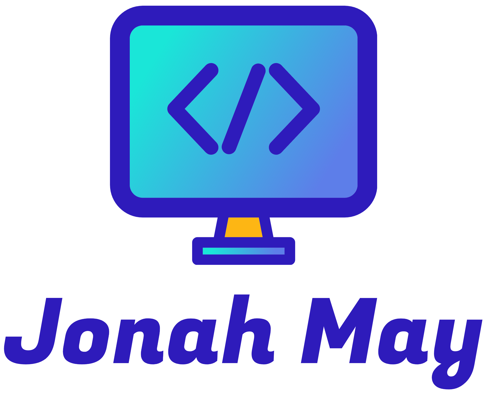

<!-- PROJECT SHIELDS -->
<!--
*** I'm using markdown "reference style" links for readability.
*** Reference links are enclosed in brackets [ ] instead of parentheses ( ).
*** See the bottom of this document for the declaration of the reference variables
*** for contributors-url, forks-url, etc. This is an optional, concise syntax you may use.
*** https://www.markdownguide.org/basic-syntax/#reference-style-links
-->
[![Contributors][contributors-shield]][contributors-url]
[![Forks][forks-shield]][forks-url]
[![Stargazers][stars-shield]][stars-url]
[![Issues][issues-shield]][issues-url]
[![MIT License][license-shield]][license-url]
[![LinkedIn][linkedin-shield]][linkedin-url]

<!-- PROJECT LOGO -->
 

  

  <h3 align="center">Veeam Automation Scripts</h3>

  

    A collection of scripts that can be used with Veeam products!
     
     
    <a href="https://github.com/JonahMMay/veeamautomation/issues">Report Bug</a>
    ·
    <a href="https://github.com/JonahMMay/veeamautomation/issues">Request Feature</a>
  

<!-- TABLE OF CONTENTS -->

  
Table of Contents

  <ol>
    <li>
      <a href="#about-the-project">About The Project</a>
      <ul>
        <li><a href="#built-with">Built With</a></li>
      </ul>
    </li>
    <li>
      <a href="#getting-started">Getting Started</a>
      <ul>
        <li><a href="#prerequisites">Prerequisites</a></li>
        <li><a href="#installation">Installation</a></li>
      </ul>
    </li>
    <li><a href="#usage">Usage</a></li>
    <li><a href="#roadmap">Roadmap</a></li>
    <li><a href="#contributing">Contributing</a></li>
    <li><a href="#license">License</a></li>
    <li><a href="#contact">Contact</a></li>
    <li><a href="#acknowledgments">Acknowledgments</a></li>
  </ol>

<!-- ABOUT THE PROJECT -->
## About The Project

As I've worked with Veeam, I have created scripts to make Veeam and VMware tasks easier through scripts and automations. This repository serves as location to host the more recent scripts.

(<a href="#readme-top">back to top</a>)

### Built With

The following major frameworks/libraries/languages have been used for these scripts:

* [![PowerShell][Powershell]][Powershell-url]

(<a href="#readme-top">back to top</a>)

<!-- ROADMAP -->
## Roadmap

See the [open issues](https://github.com/othneildrew/Best-README-Template/issues) for a full list of proposed features (and known issues).

(<a href="#readme-top">back to top</a>)

<!-- CONTRIBUTING -->
## Contributing

Contributions are what make the open source community such an amazing place to learn, inspire, and create. Any contributions you make are **greatly appreciated**.

If you have a suggestion that would make this better, please fork the repo and create a pull request. You can also simply open an issue with the tag "enhancement".
Don't forget to give the project a star! Thanks again!

1. Fork the Project
2. Create your Feature Branch (`git checkout -b feature/AmazingFeature`)
3. Commit your Changes (`git commit -m 'Add some AmazingFeature'`)
4. Push to the Branch (`git push origin feature/AmazingFeature`)
5. Open a Pull Request

(<a href="#readme-top">back to top</a>)

<!-- LICENSE -->
## License

Distributed under the MIT License. See `LICENSE.txt` for more information.

(<a href="#readme-top">back to top</a>)

<!-- CONTACT -->
## Contact

Jonah May - [@jonahmayrocks](https://twitter.com/jonahmayrocks) - jonah@mayfamily.me

Project Link: [https://github.com/JonahMMay/veeamautomation](https://github.com/JonahMMay/veeamautomation)

(<a href="#readme-top">back to top</a>)

<!-- ACKNOWLEDGMENTS -->
## Acknowledgments

Here are other locations which provide basic Veeam scripts or API libraries:

* [Veeam Automation Desk](https://community.veeam.com/groups/automation-desk-103)
* [Veeam R&D Forums](https://forums.veeam.com/)
* [VeeamHub](https://github.com/VeeamHub)
* [Veeam Backup PowerShell Reference](https://helpcenter.veeam.com/docs/backup/powershell/getting_started.html)
* [Veeam Backup & Replication REST API Reference](https://helpcenter.veeam.com/docs/backup/vbr_rest/rest_api_reference.html)
* [Veeam Backup Enterprise Manager REST API Reference](https://helpcenter.veeam.com/docs/backup/em_rest/overview.html)
* [Veeam Backup for Microsoft 365 PowerShell Reference](https://helpcenter.veeam.com/docs/vbo365/powershell/veeam_psreference.html)
* [Veeam Backup for Microsoft 365 REST API Reference](https://helpcenter.veeam.com/docs/vbo365/rest/overview.html)
* [Veeam Service Provider Console REST API Reference](https://helpcenter.veeam.com/docs/vac/rest/reference/vspc-rest.html)

(<a href="#readme-top">back to top</a>)

<!-- MARKDOWN LINKS & IMAGES -->
<!-- https://www.markdownguide.org/basic-syntax/#reference-style-links -->
[contributors-shield]: https://img.shields.io/github/contributors/JonahMMay/veeamautomation.svg?style=for-the-badge
[contributors-url]: https://github.com/JonahMMay/veeamautomation/graphs/contributors
[forks-shield]: https://img.shields.io/github/forks/JonahMMay/veeamautomation.svg?style=for-the-badge
[forks-url]: https://github.com/JonahMMay/veeamautomation/network/members
[stars-shield]: https://img.shields.io/github/stars/JonahMMay/veeamautomation.svg?style=for-the-badge
[stars-url]: https://github.com/JonahMMay/veeamautomation/stargazers
[issues-shield]: https://img.shields.io/github/issues/JonahMMay/veeamautomation.svg?style=for-the-badge
[issues-url]: https://github.com/JonahMMay/veeamautomation/issues
[license-shield]: https://img.shields.io/github/license/JonahMMay/veeamautomation.svg?style=for-the-badge
[license-url]: https://github.com/JonahMMay/veeamautomation/blob/master/LICENSE.txt
[linkedin-shield]: https://img.shields.io/badge/-LinkedIn-black.svg?style=for-the-badge&logo=linkedin&colorB=555
[linkedin-url]: https://www.linkedin.com/in/jonah-m254/
[product-screenshot]: images/screenshot.png
[Next.js]: https://img.shields.io/badge/next.js-000000?style=for-the-badge&logo=nextdotjs&logoColor=white
[Next-url]: https://nextjs.org/
[React.js]: https://img.shields.io/badge/React-20232A?style=for-the-badge&logo=react&logoColor=61DAFB
[React-url]: https://reactjs.org/
[Vue.js]: https://img.shields.io/badge/Vue.js-35495E?style=for-the-badge&logo=vuedotjs&logoColor=4FC08D
[Vue-url]: https://vuejs.org/
[Angular.io]: https://img.shields.io/badge/Angular-DD0031?style=for-the-badge&logo=angular&logoColor=white
[Angular-url]: https://angular.io/
[Svelte.dev]: https://img.shields.io/badge/Svelte-4A4A55?style=for-the-badge&logo=svelte&logoColor=FF3E00
[Svelte-url]: https://svelte.dev/
[Laravel.com]: https://img.shields.io/badge/Laravel-FF2D20?style=for-the-badge&logo=laravel&logoColor=white
[Laravel-url]: https://laravel.com
[Bootstrap.com]: https://img.shields.io/badge/Bootstrap-563D7C?style=for-the-badge&logo=bootstrap&logoColor=white
[Bootstrap-url]: https://getbootstrap.com
[JQuery.com]: https://img.shields.io/badge/jQuery-0769AD?style=for-the-badge&logo=jquery&logoColor=white
[JQuery-url]: https://jquery.com 
[Powershell]: https://img.shields.io/badge/PowerShell-0769AD?style=for-the-badge&logo=powershell&logoColor=white
[Powershell-url]: https://learn.microsoft.com/en-us/powershell/
